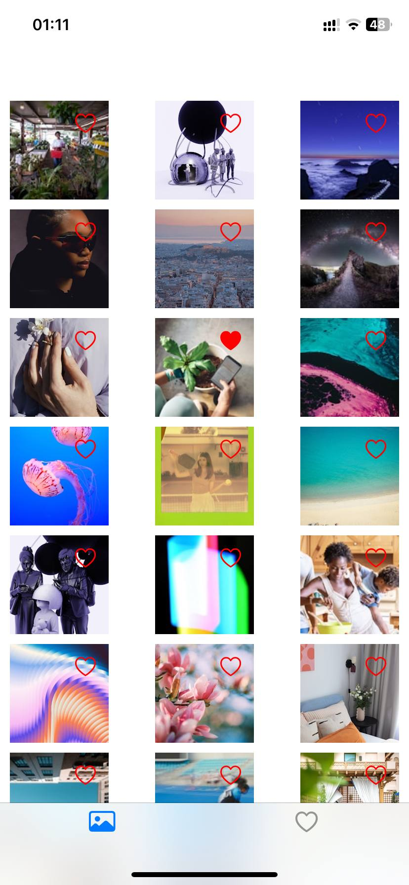
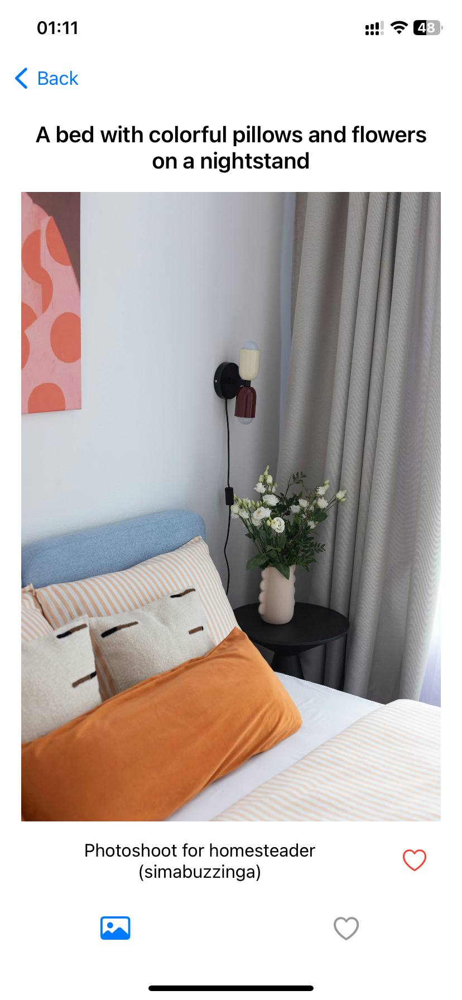
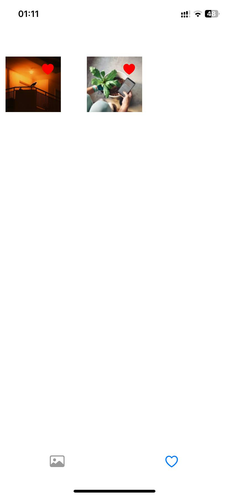

# GalleryApp — iOS Trainee Test Task

## Contact Information
- **Telegram**: [@luploof](https://t.me/luploof)
- **Email**: [luploof@gmail.com](mailto:luploof@gmail.com)

## About the Project
**GalleryApp** is an iOS application that allows users to browse photos from the Unsplash editorial feed. 
Users can view a gallery, mark photos as favorites, remove them from favorites, and view detailed information about each photo with swipe navigation.

## Key Features That Make the App Unique
- **Like directly from the gallery** – users can favorite photos with a single tap without opening the detail screen.
- **Smooth pagination** – automatic loading of next page when scrolling to the bottom, with loading indicator.
- **Offline-ready favorites** – favorites are stored in Core Data and remain available after app restart.
- **Real-time sync** – favorite status updates instantly across Gallery, Detail, and Favorites screens using NotificationCenter.
- **Gesture navigation** – swipe left/right on the detail screen to browse through photos.
- **Type-safe error handling** – custom typed throws (NetworkError, DatabaseError, ImageLoadingError) for better debugging and user feedback.
- **Clean Architecture + MVVM** – code is modular, testable, and follows SOLID principles.
- **Async/await networking** – modern concurrency for smooth UI performance.

## Architecture & Technologies
### Architecture
- **Clean Architecture** + **MVVM**
- **Domain** — entities, repository protocols, use cases
- **Data** — repository implementations, networking (URLSession + async/await), Core Data
- **Presentation** — ViewModel, ViewController, custom cells

### Technologies
- Swift
- UIKit
- URLSession + async/await
- Core Data
- SwiftLint
- CocoaPods
- Swift Testing

## Screenshots or Demo
### Screenshots

**Gallery Screen**  


**Detail Screen**  


**Favorites Screen**  


### Video Demo
<video src="https://raw.githubusercontent.com/Luploof/GalleryApp/main/Screenshots/video.MP4" controls width="400">
If the video does not play, [download it directly](https://raw.githubusercontent.com/Luploof/GalleryApp/main/Screenshots/video.MP4).

## Configuration
### System Requirements
- iOS 17.0+ 
- Xcode 15.0+ 
- Swift 5.9+
 
### Unsplash API Key
1. Register at [Unsplash Developers](https://unsplash.com/developers)
2. Create a new application and get your **Access Key**
3. Create a `Config.plist` file in the project root with the following content:

```xml
<?xml version="1.0" encoding="UTF-8"?>
<!DOCTYPE plist PUBLIC "-//Apple//DTD PLIST 1.0//EN" "http://www.apple.com/DTDs/PropertyList-1.0.dtd">
<plist version="1.0">
<dict>
    <key>UnsplashAccessKey</key>
    <string>YOUR_ACCESS_KEY</string>
</dict>
</plist>

